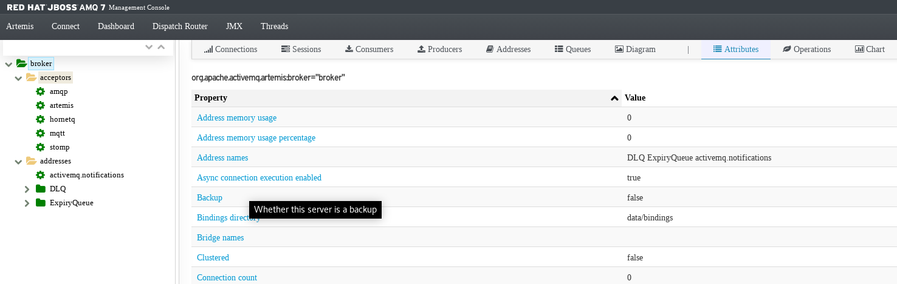

= 消息服务
:toc: manual

== AMQ 部署

=== 本地部署

[source, text]
.*1. 解压安装*
----
$ unzip amq-broker-7.2.3-bin.zip && cd amq-broker-7.2.3
----

[source, text]
.*2. 创建一个 broker*
----
$ ./bin/artemis create --user admin --password admin --role admin --allow-anonymous y ./instances/broker1
----

[source, text]
.*3. 启动 broker*
----
$ cd instances/broker1/
$ ./bin/artemis run
----

*4. 访问 AMQ Console*

Access the http://localhost:8161/console in a broswer, login with `admin`/`admin`.

=== 部署到 OpenShift

[source, text]
.*1. 下载 Imagestream 模版*
----
# wget https://raw.githubusercontent.com/jboss-container-images/jboss-amq-7-broker-openshift-image/amq-broker-72/amq-broker-7-image-streams.yaml
----

[source, text]
.*2. 编辑 Imagestream, 修改 registry.access.redhat.com 为 registry.example.com*
----
# vim amq-broker-7-image-streams.yaml
...
registry.example.com/amq-broker-7/amq-broker-72-openshift:1.1
registry.example.com/amq-broker-7/amq-broker-72-openshift:1.0
----

[source, text]
.*3. 创建 Imagestream*
----
# oc replace --force  -f amq-broker-7-image-streams.yaml -n openshift
----

[source, text]
.*4. 创建 AMQ Broker link:etc/files/amq-broker-72-basic.yaml[amq-broker-72-basic.yaml]*
----
$ oc new-project message-service
$ oc create -f etc/files/amq-broker-72-basic.yaml
$ oc policy add-role-to-user view system:serviceaccount:message-service:amq-service-account
$ oc new-app --template=amq-broker-72-basic -e AMQ_PROTOCOL=openwire,amqp,stomp,mqtt,hornetq -e AMQ_USER=admin -e AMQ_PASSWORD=admin -e AMQ_ROLE=admin
----

[source, text]
.*5. 查看运行的容器*
----
# oc get pods
NAME                 READY     STATUS    RESTARTS   AGE
broker-amq-1-8gsv7   1/1       Running   0          1m
----

[source, text]
.*6. 查看消息服务*
----
$ oc get svc
NAME                 TYPE        CLUSTER-IP       EXTERNAL-IP   PORT(S)     AGE
broker-amq-amqp      ClusterIP   172.30.2.115     <none>        5672/TCP    <invalid>
broker-amq-jolokia   ClusterIP   172.30.91.132    <none>        8161/TCP    <invalid>
broker-amq-mqtt      ClusterIP   172.30.142.33    <none>        1883/TCP    <invalid>
broker-amq-stomp     ClusterIP   172.30.233.183   <none>        61613/TCP   <invalid>
broker-amq-tcp       ClusterIP   172.30.64.96     <none>        61616/TCP   <invalid>
----

*7. 登录 AMQ Console*

访问 http://amq-console-message-service.apps.example.com , 使用 `admin`/`admin`.

== AMQP

=== 本地运行

[source, text]
.*1. 编辑构建*
----
$ cd amqp/ && mvn clean install
----

[source, text]
.*2. 运行*
----
$ java -jar target/amqp-transform-1.0.0.jar
----

[source, text]
.*3. 测试*
----
$ curl -X GET http://localhost:8080/amqp/api/ping
PONG FROM CAMEL CONTEXT

$ curl -X POST http://localhost:8080/amqp/api/match -d '{"id": "1001", "name": "REDHAT", "age": 26, "title": "Leader of OpenSource"}' -H 'content-type: application/json'
{"result":"DONE"}
----

[source, text]
.*4. 查看 Console 日志输出*
----
16:50:06.705 [XNIO-3 task-1] INFO  matchRoute - Receive From Inboud Request: Person [id=1001, name=REDHAT, age=26, title=Leader of OpenSource]
16:50:06.732 [XNIO-3 task-1] INFO  matchRoute - Convert to JSON: {"id":"1001","name":"REDHAT","age":26,"title":"Leader of OpenSource"}
16:50:06.733 [XNIO-3 task-1] INFO  matchRoute - Send to Queue
16:50:06.802 [Camel (MyCamel) thread #1 - JmsConsumer[q.new.inboud]] INFO  consumeRoute - Consume From Queue: {"id":"1001","name":"REDHAT","age":26,"title":"Leader of OpenSource"}
----

=== 部署到 OpenShift

[source, text]
.*1. 部署*
----
$ mvn fabric8:deploy -Popenshift
----

[source, text]
.*2. 测试*
----
$ curl -X POST http://amqp-transform-message-service.apps.example.com/amqp/api/match -d '{"id": "1001", "name": "REDHAT", "age": 26, "title": "Leader of OpenSource"}' -H 'content-type: application/json'
{"result":"DONE"}
----

[source, text]
.*3. 查看 Console 日志*
----
17:08:31.643 [XNIO-3 task-1] INFO  matchRoute - Receive From Inboud Request: Person [id=1001, name=REDHAT, age=26, title=Leader of OpenSource]
17:08:31.659 [XNIO-3 task-1] INFO  matchRoute - Convert to JSON: {"id":"1001","name":"REDHAT","age":26,"title":"Leader of OpenSource"}
17:08:31.659 [XNIO-3 task-1] INFO  matchRoute - Send to Queue
17:08:31.779 [Camel (MyCamel) thread #1 - JmsConsumer[q.new.inboud]] INFO  consumeRoute - Consume From Queue: {"id":"1001","name":"REDHAT","age":26,"title":"Leader of OpenSource"}
----

== MQTT

=== 本地运行

[source, text]
.*1. 编辑构建*
----
$ cd mqtt/ && mvn clean install
----

[source, text]
.*2. 运行*
----
$ java -jar target/mqtt-transform-1.0.0.jar
----

[source, text]
.*3. 测试*
----
$ curl -X GET http://localhost:8080/mqtt/api/ping
PONG FROM CAMEL CONTEXT

$ curl -X POST http://localhost:8080/mqtt/api/event -d '{"deviceId": "DIV-X3FZ", "command": "SensorData", "data": "[\"XXX\"]", "createDate": 1476711243326, "nodeId": "NODE-ID", "sensorId": "SENSOR-ID"}' -H 'content-type: application/json'
{"result":"SUCCESS"}
----

[source, text]
.*4. 查看 Console 日志输出*
----
20:15:59.872 [XNIO-3 task-2] INFO  matchRoute - Receive From Inboud Request: com.sample.model.Event@2e888aa0
20:15:59.891 [XNIO-3 task-2] INFO  matchRoute - Convert to JSON: {"deviceId":"DIV-X3FZ","command":"SensorData","data":"[\"XXX\"]","createDate":1476711243326,"nodeId":"NODE-ID","sensorId":"SENSOR-ID"}
20:15:59.891 [XNIO-3 task-2] INFO  matchRoute - Publish to Topic
20:15:59.892 [XNIO-3 task-2] INFO  o.a.c.component.mqtt.MQTTEndpoint - Connecting to tcp://127.0.0.1:1883 using 10 seconds timeout
20:15:59.903 [hawtdispatch-DEFAULT-3] WARN  o.a.c.component.mqtt.MQTTEndpoint - No topic subscriptions were specified in configuration
20:15:59.903 [hawtdispatch-DEFAULT-3] INFO  o.a.c.component.mqtt.MQTTEndpoint - MQTT Connection connected to tcp://127.0.0.1:1883
20:15:59.917 [hawtdispatch-DEFAULT-2] INFO  consumeRoute - Sensor Data: {"deviceId":"DIV-X3FZ","command":"SensorData","data":"[\"XXX\"]","createDate":1476711243326,"nodeId":"NODE-ID","sensorId":"SENSOR-ID"}
----

=== 部署到 OpenShift

[source, text]
.*1. 部署*
---- 
$ mvn fabric8:deploy -Popenshift
----

[source, text]
.*2. 测试*
----
$ curl -X POST http://mqtt-transform-message-service.apps.example.com/mqtt/api/event -d '{"deviceId": "DIV-X3FZ", "command": "SensorData", "data": "[XXX]", "createDate": 1476711243326, "nodeId": "NODE-ID", "sensorId": "SENSOR-ID"}' -H 'content-type: application/json'
{"result":"SUCCESS"}
----

[source, text]
.*3. 查看 Console 日志输出*
----
20:36:49.871 [XNIO-3 task-1] INFO  matchRoute - Receive From Inboud Request: com.sample.model.Event@68d5885d
20:36:49.885 [XNIO-3 task-1] INFO  matchRoute - Convert to JSON: {"deviceId":"DIV-X3FZ","command":"SensorData","data":"[XXX]","createDate":1476711243326,"nodeId":"NODE-ID","sensorId":"SENSOR-ID"}
20:36:49.886 [XNIO-3 task-1] INFO  matchRoute - Publish to Topic
20:36:49.887 [XNIO-3 task-1] INFO  o.a.c.component.mqtt.MQTTEndpoint - Connecting to tcp://broker-amq-mqtt:1883 using 10 seconds timeout
20:36:49.904 [hawtdispatch-DEFAULT-1] WARN  o.a.c.component.mqtt.MQTTEndpoint - No topic subscriptions were specified in configuration
20:36:49.905 [hawtdispatch-DEFAULT-1] INFO  o.a.c.component.mqtt.MQTTEndpoint - MQTT Connection connected to tcp://broker-amq-mqtt:1883
20:36:49.930 [hawtdispatch-DEFAULT-1] INFO  consumeRoute - Sensor Data: {"deviceId":"DIV-X3FZ","command":"SensorData","data":"[XXX]","createDate":1476711243326,"nodeId":"NODE-ID","sensorId":"SENSOR-ID"}
----

== Kafka Stream
